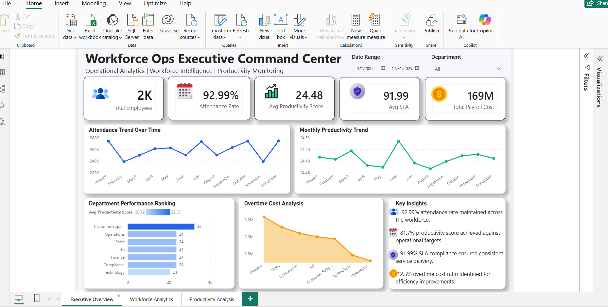
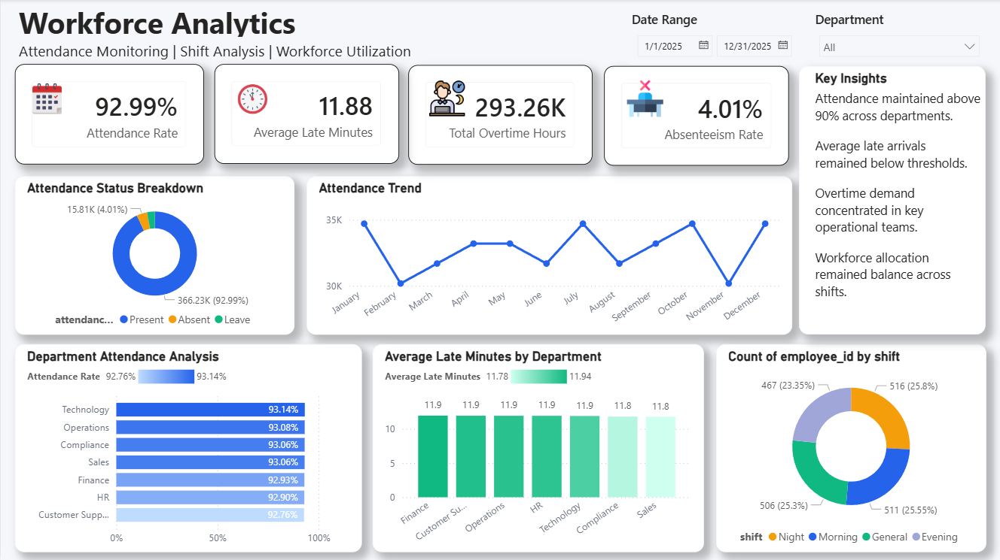
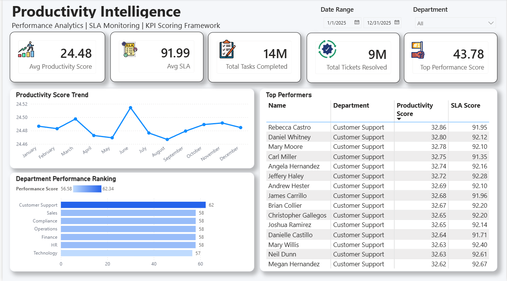

# WorkforceOps Analytics Platform

## Overview

WorkforceOps Analytics Platform is an end-to-end Analytics Engineering project designed to monitor workforce productivity, attendance performance, SLA compliance, and operational efficiency.

The solution simulates an enterprise-scale reporting environment using Python, SQL, and Power BI while following modern analytics engineering practices including Bronze, Silver, and Gold data layers.

This project demonstrates data modeling, ETL design, KPI engineering, business intelligence, and executive reporting capabilities commonly used in modern analytics teams.

---

## Business Problem

Organizations often struggle with fragmented workforce data spread across multiple operational systems, making it difficult to monitor attendance, productivity, service quality, and workforce utilization.

This project centralizes workforce, productivity, and financial metrics into a unified analytics platform that enables leadership teams to:

- Monitor workforce performance
- Improve staffing decisions
- Track operational KPIs
- Identify productivity trends
- Optimize workforce utilization
- Improve executive visibility

---

## Solution Architecture

Raw Data Sources
        │
        ▼
Bronze Layer
(Raw Ingestion)
        │
        ▼
Silver Layer
(Data Cleaning & Validation)
        │
        ▼
Gold Layer
(Business Ready Data)
        │
        ▼
Star Schema Model
        │
        ▼
Power BI Dashboards

---

## Tech Stack

### Data Engineering

- Python
- Pandas
- CSV Processing
- ETL Pipelines

### Analytics Engineering

- Data Modeling
- Star Schema Design
- KPI Engineering
- Data Quality Validation

### Analytics & BI

- Power BI
- DAX
- Executive Reporting
- Dashboard Design

### Database

- SQL
- Relational Modeling

---

## Key Features

### Workforce Analytics

- Attendance Tracking
- Absenteeism Monitoring
- Late Arrival Analysis
- Overtime Analysis
- Shift Distribution Analysis

### Productivity Intelligence

- Productivity Score Monitoring
- SLA Compliance Tracking
- Department Benchmarking
- Employee Performance Analysis
- Top Performer Identification

### Executive Reporting

- Workforce KPIs
- Productivity KPIs
- Financial KPIs
- Trend Analysis
- Operational Insights

### Analytics Engineering

- Bronze Layer
- Silver Layer
- Gold Layer
- Data Quality Checks
- Star Schema Modeling
- KPI Framework

---

## Data Model

### Dimension Table

#### dim_employee

| Column |
|----------|
| employee_id |
| employee_name |
| department |
| role |
| shift |
| location |

### Fact Tables

#### fact_attendance

| Column |
|----------|
| attendance_id |
| employee_id |
| attendance_date |
| work_hours |
| overtime_hours |
| late_minutes |
| attendance_status |

#### fact_productivity

| Column |
|----------|
| productivity_id |
| employee_id |
| date |
| tasks_completed |
| tickets_resolved |
| avg_handle_time |
| productivity_score |
| sla_score |

#### fact_finance

| Column |
|----------|
| finance_id |
| employee_id |
| payroll_cost |
| overtime_cost |

---

## KPI Framework

### Attendance KPIs

- Attendance Rate
- Absenteeism Rate
- Average Late Minutes
- Overtime Hours

### Productivity KPIs

- Productivity Score
- SLA Compliance
- Tasks Completed
- Tickets Resolved

### Financial KPIs

- Payroll Cost
- Overtime Cost
- Workforce Utilization

---

## Dashboard Pages

### Executive Overview

Provides leadership-level visibility into workforce performance through:

- Total Employees
- Attendance Rate
- Productivity Score
- SLA Compliance
- Payroll Cost
- Department Performance Ranking
- Productivity Trends
- Overtime Analysis

### Workforce Analytics

Provides workforce operational insights including:

- Attendance Status Breakdown
- Attendance Trends
- Department Attendance Analysis
- Late Arrival Monitoring
- Overtime Tracking
- Shift Distribution Analysis

### Productivity Intelligence

Provides productivity-focused analytics including:

- Productivity Score Tracking
- SLA Monitoring
- Department Benchmarking
- Top Performer Analysis
- KPI Scoring Framework
- Productivity Trend Analysis

---

## Dashboard Preview

### Executive Overview

### Workforce Analytics

### Productivity Intelligence

---

## Project Structure

text
WorkforceOps-Analytics-Platform/

├── architecture/
│   └── architecture-diagram.png

├── datasets/
│   ├── raw/
│   └── processed/

├── python/
│   ├── generators/
│   └── transformations/

├── sql/
│   ├── schema/
│   └── marts/

├── docs/
│   ├── data-model.md
│   ├── kpi-framework.md
│   └── data-quality-framework.md

├── powerbi/
│   └── screenshots/

└── README.md

---

## Analytics Engineering Concepts Demonstrated

- ETL Pipeline Design
- Data Quality Validation
- Star Schema Modeling
- KPI Engineering
- Business Metric Design
- Data Transformation
- Workforce Analytics
- Operational Reporting
- Executive Dashboarding
- Performance Monitoring

---

## Business Impact

The platform enables organizations to:

- Improve workforce visibility
- Monitor attendance performance
- Track productivity trends
- Analyze SLA compliance
- Optimize overtime utilization
- Support data-driven operational decisions

---

## Future Enhancements

- Azure Data Factory Integration
- REST API Data Ingestion
- Incremental Data Processing
- Automated Data Refresh
- DataOps Monitoring
- Azure SQL Integration
- Cloud Deployment
- Real-Time Workforce Monitoring

---

## Author

### Gunjan Khatri

Data Analyst | Power BI Developer | Aspiring Analytics Engineer

### Skills

- SQL
- Python
- Power BI
- Azure Data Factory
- Data Modeling
- ETL Pipelines
- KPI Engineering
- Analytics Engineering
- Business Intelligence

---

## License

This project was created for educational and portfolio purposes using synthetic data and does not contain any confidential business information.
